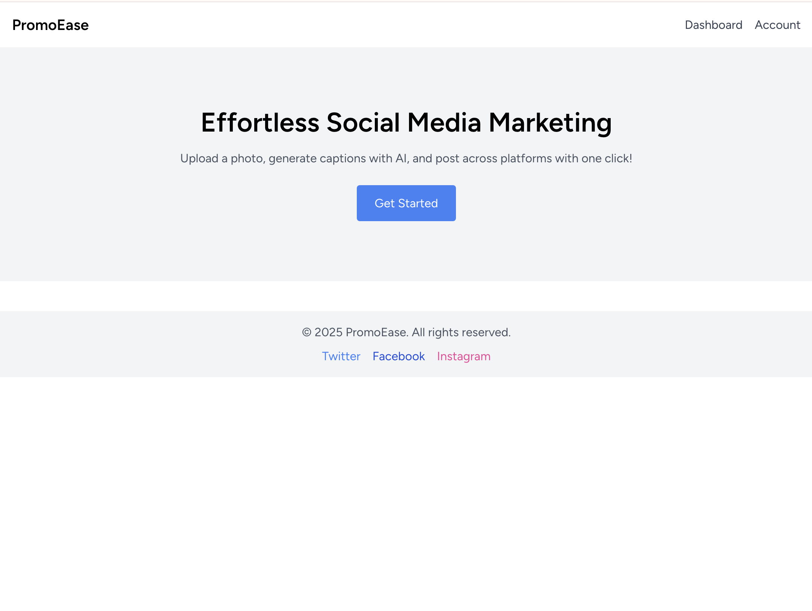
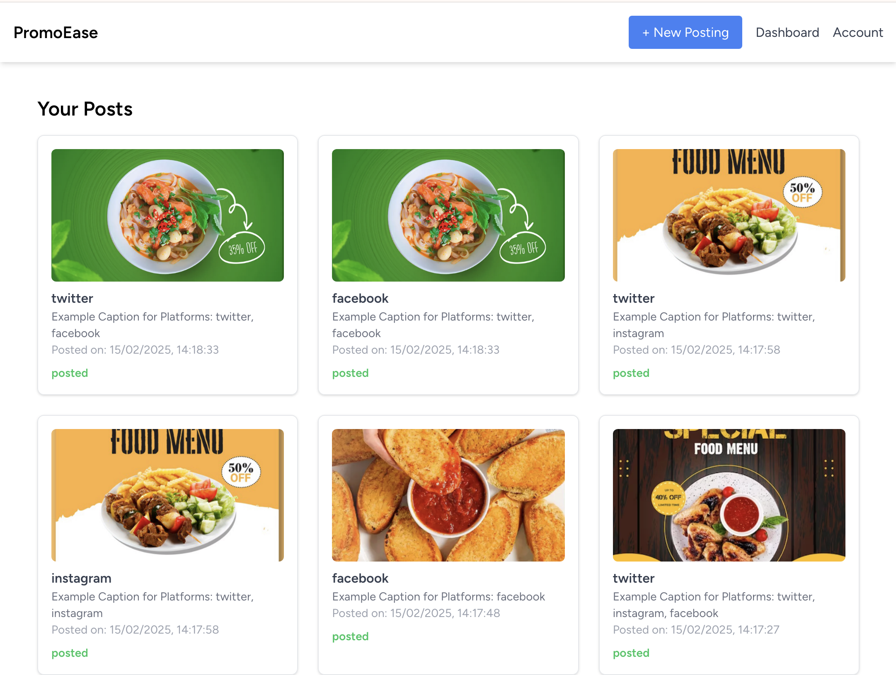
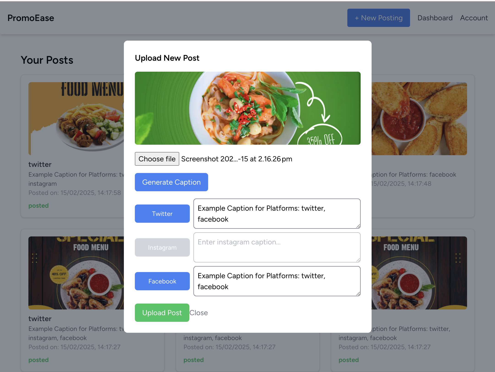

# 🚀 Promoease Web

## 🚨 [DEPRECATED] This project is being migrated!  
This repository (`promoease-web`) is the initial Laravel-based version of Promoease.  
We are migrating the project to **Python (FastAPI + Django)** for better AI integration.  
👉 **New repository: [`promoease-ai`](https://github.com/heeran-kim/promoease-ai)**

---

## 📌 Project Overview

Promoease Web is a Laravel-based platform designed to help restaurant owners efficiently create and manage social media posts with AI-generated captions. The system allows users to upload images, generate AI-powered captions, and publish posts across multiple social media platforms.

---

## 🚀 Features

### Preview
| Landing Page - Get Started | Dashboard - Manage Your Posts | Upload New Post - AI Caption Generation |
|-|-|-|
| Intro screen with an option to start creating posts. | Shows a list of uploaded posts, their captions, and their posting status. | Users can upload an image, generate AI-powered captions, and publish to multiple social platforms. |
|  |  |  |

### Details
1️⃣ **Image Upload & Storage**
- Users can upload images to the platform.
- Uploaded images are stored securely in the Laravel storage system.

2️⃣ **AI-Generated Captions *(Planned, Now Migrating)***
- AI-powered captions for social media posts.
- Captions automatically generated based on uploaded images.
- Supports multiple social media platforms (Instagram, Facebook, Twitter, etc.).

3️⃣ **Social Media Publishing *(Planned, Now Migrating)***
- Users can publish AI-generated posts directly to their social media accounts.
- The system supports multiple platform integrations.

4️⃣ **Post Management Dashboard**
- A user-friendly dashboard to view, manage, and track published posts.
- Users can see the status of each post (published, failed, pending).

5️⃣ **User Authentication & Security**
- Secure user authentication system (Laravel Breeze).
- Users can sign up, log in, and manage their accounts.

---

## 📌 Tech Stack
- **Backend**: Laravel 10 (PHP)
- **Database**: MySQL
- **Frontend**: Inertia.js + React, TailwindCSS
- **Authentication**: Laravel Breeze

---

## 📌 Project Structure
```text
📂 promoease-web/
 ┣ 📂 app/                # Laravel backend logic  
 ┣ 📂 database/           # Migrations & seeders  
 ┣ 📂 resources/          # Frontend (Inertia.js & React)  
 ┣ 📂 routes/             # API & web routes (Laravel)  
 ┣ 📂 storage/            # Uploaded images  
 ┣ 📂 public/             # Public assets  
 ┣ 📜 README.md           # Project documentation  
 ┣ 📜 .env                # Environment variables  
 ┗ 📜 composer.json       # Laravel dependencies  
```
---

## 📌 Installation & Setup

1️⃣ Clone the repository
```bash
git clone https://github.com/heeran-kim/promoease-web.git
cd promoease-web
```

2️⃣ Install dependencies
```bash
composer install
npm install
```

3️⃣ Configure the environment
	•	Copy the .env.example file and rename it to .env
	•	Update database credentials (DB_DATABASE, DB_USERNAME, DB_PASSWORD)
	•	Run migrations to set up the database
```bash
php artisan migrate
```

4️⃣ Run the application
```bash
php artisan serve  # Starts Laravel backend  
npm run dev        # Starts frontend (React + Inertia.js)
```
---

## 📌 Why Migrate from Laravel to Python?

🔹 **Limitations of Laravel for AI Integration**
1.	AI/ML Compatibility Issues
  - Laravel is not optimized for AI/ML development, making complex AI features harder to implement.
2.	Performance Considerations
  - AI model serving requires asynchronous requests (Laravel is not optimal for this).
3.	Scalability & Future Growth
  - Python ecosystem (FastAPI, TensorFlow, PyTorch) is more suitable for AI/ML scalability.

🚀 **Advantages of Python-based Migration**
1.	FastAPI for AI API Development
  - Optimized for real-time AI processing
  - Supports asynchronous requests for high performance
2.	Django for Backend Management
  - Better for admin panel & database management
3.	Scikit-learn / TensorFlow for AI Model Training
  - Custom AI models can be trained & deployed directly

---

## 📌 License

This project is licensed under the MIT License.

---

### 🚀 Promoease Web is now transitioning to a Python-based AI-powered platform! Stay tuned! 🎉